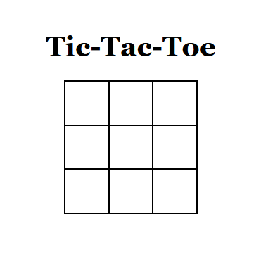

# React Tic-Tac-Toe game 🚀

A simple tic tac toe game made using React.js

## Features ✨

- Play tic-tac-toe in your browser!

### Don't know how to play? No problem!

### Rules 📜

1. **Players:** Two players take turns, one as "X" and the other as "O."

2. **Game Board:** The game board is a 3x3 grid where you place your symbols.

3. **Winning:** You can win by getting three of your symbols in a row:

   - Horizontally
   - Vertically
   - Diagonally

4. **Taking Turns:** Players place their symbol in any empty cell on the board during their turn.

5. **Game Over:** The game ends when:
   - One player wins
   - The board is full (resulting in a draw)

## Installation & Usage 🛠️

1. Clone the repository using `git clone https://github.com/BeanyTheCoder/repo-name.git`.

2. Navigate to the project directory using `cd  repo-name`.
3. Install dependencies with `npm install`.
4. Run the app with `npm run dev`.

## Screenshots 📷

## Technologies Used 🛠️

- React.js
- HTML & CSS

## License 📝

This project is licensed under the [License Name](link-to-license-file).

## Acknowledgments 🙏

- Credit to inspiration sources or contributors.

## Contact 📧

For any questions or feedback, feel free to reach out to me at alexanderafoko@gmail.com.

## Project Status

Current status on the project
